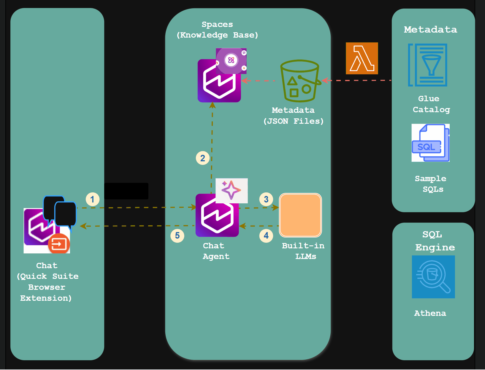

# AI Data Discovery Agent using AWS Quick-Suite


## Overview

This project is for implementation of an **AI-powered Data Discovery & SQL Generation Agent** using **Amazon Quick Suite** leveraging the following key components:

* **Amazon Glue Data Catalog** – for table and metadata management
* **Amazon Athena** – for collecting saved queries in the workgroups and linking these queries to respective tables.
* **Amazon S3** – as object store for JSON Metadata Files generated from the Glue Catalog and Sample SQLs
* **Amazon Quick Suite** – for knowledge-base ingestion (RAG equivalent), chat agents, and chat browser extension
* **Large Language Models (LLMs)** – Quick Suite uses built-in LLM and as of now there is no optin to configure this . [More details](https://community.amazonquicksight.com/t/quick-suite-llm-model-which-one-is-default-can-we-change/50491)

This solution automates:

* Extraction of fine-grained metadata (tables, columns, partitions, descriptions, view SQLs)
* Ingestion and indexing of that metadata + sample SQLs into Quick Suite knowledge bases
* Enabling an AI Agent that can:

  * Discover datasets and their structure
  * Understand business meaning of fields
  * Generate accurate SQL queries for analytics or validation

---

##  Some Context

In My official AWS Blog publoshed in October 2024 [Enrichment of Metadata for Text-to-SQL](https://aws.amazon.com/blogs/big-data/enriching-metadata-for-accurate-text-to-sql-generation-for-amazon-athena), illustrated how rich, high-quality metadata is *critical* for accurate text-to-SQL generation.  Since then, the landscape has transformed dramatically. New services introduced by AWS and others have made building Retrieval-Augmented Generation (RAG) systems, knowledge bases, and chat-agent workflows far simpler and more enterprise-ready.

In particular, Amazon Quick Suite has come up with more advanced features AI features for the data discovery. Wanted to try it personally for this specific use-case and understand how easy it is compared to developement of the Agents and KBs from scratch.

* It provides **Knowledge Bases** built on S3, document stores and metadata, enabling semantic retrieval. ([AWS Documentation][2])
* It enables **Chat Agents** that integrate with those knowledge bases and act as natural-language interfaces to your data. ([Amazon Web Services, Inc.][3])
* It supports integration with enterprise systems, Model Context Protocol (MCP) servers and workflows — bridging insight and action. ([Amazon Web Services, Inc.][4])

This repository builds on that momentum — leveraging the latest AWS capabilities to deliver a fully integrated Data Discovery + SQL Generation agent, ready for enterprise action.


### High-Level Overview


1. A user asks a text-based question 
2. Relevant Context (metadata and sample SQLs) is fetched from Knwoledge Base
3. Context+Prompt Intrsuctions are sent to the LLM
4. LLM generates the Response depending on the user question (Clarification on user question around the data or SQL or table details).
5. Generated response is shared with the user.

## Features

* **Automated Metadata Extraction**
  Extracts table descriptions, columns, partitions, view SQL, and other metadata from AWS Glue.
* **Sample SQL Collection**
  Collects saved queries from all Athena workgroups, and matches them to tables for context.
* **RAG-Ready Knowledge Base**
  Stores structured JSON documents in S3, which are ingested into Quick Suite as knowledge bases.
* **AI Agent Integration**
  Enables natural language chat for exploring data, discovering schema, generating SQL, and detecting data-quality issues. Easy Browser-Integration for the Chat-Agent
* **SQL Generation & Validation**
  Generates safe and optimized SQL statements using LLMs, guided by metadata context and quality rules.

---

## Repository Structure

```
ai-data-discovery-agent/
│
├── README.md
├── architecture/
│   ├── ai_data_discovery_architecture.png
├── lambda/
│   ├── glue_kb_builder/
│   │   ├── handler.py
│   │   └── IAM_Policy.json
├── quicksuite/
│   ├── setting_up_knowledge_base.md
│   ├── setting_up_spaces.md
│   ├── setting_up_agent.md
│   └── setting_up_browser_extension.md
└── LICENSE
```

---

## Setup & Deployment

1. Configure IAM roles with appropriate permissions (Glue, Athena, Lake Formation, S3, STS) documented here [IAM_Policy](https://github.com/rongali-naidu/ai-data-discovery-agent/blob/main/lambda/glue_kb_builder/IAM_Policy.json). Note: The policy is given as an example and it doesnt restrict the resources. so, change this as per your requirement.
2. Set up S3 Bucket for storing metadata details required for setting up the Knowledge base
3. Deploy the Lambda functions with the handler code from `lambda/handler.py` folder.
4. Schedule or trigger the extractor Lambda to populate S3.
5. Ingest the generated JSON files into Quick Suite as knowledge base
6. Crate Quick Suite Space linking the Knowledge Base
7. Create a Quick Suite Agent, assign the knowledge base(s), and use the sample prompt template in `quicksuite/setting_up_agent.md`.
8. Use the Quick Suite's Browser Extension for end-user access.


---

## References

* “Enriching metadata for accurate text-to-SQL generation for Amazon Athena”, AWS Big Data Blog. ([Amazon Web Services, Inc.][1])
* “Announcing Amazon Quick Suite: your agentic teammate for answering questions and taking action.” ([Amazon Web Services, Inc.][5])
* “Connect Amazon Quick Suite to enterprise apps and agents with MCP.” ([Amazon Web Services, Inc.][4])
* “Establishing enterprise governance in Amazon Quick Suite using custom permissions.” ([Amazon Web Services, Inc.][6])


[1]: https://aws.amazon.com/blogs/big-data/enriching-metadata-for-accurate-text-to-sql-generation-for-amazon-athena/ "Enriching metadata for accurate text-to-SQL generation ..."
[2]: https://docs.aws.amazon.com/quicksuite/latest/userguide/knowledge-base-integrations.html "Knowledge bases - Amazon Quick Suite - AWS Documentation"
[3]: https://aws.amazon.com/quicksuite/ "Amazon Quick Suite – AWS - Agentic AI"
[4]: https://aws.amazon.com/blogs/machine-learning/connect-amazon-quick-suite-to-enterprise-apps-and-agents-with-mcp/ "Connect Amazon Quick Suite to enterprise apps and agents with MCP"
[5]: https://aws.amazon.com/blogs/aws/reimagine-the-way-you-work-with-ai-agents-in-amazon-quick-suite/ "Announcing Amazon Quick Suite: your agentic teammate for ..."
[6]: https://aws.amazon.com/blogs/business-intelligence/establishing-enterprise-governance-in-amazon-quick-suite-using-custom-permissions/ "Establishing enterprise governance in Amazon Quick Suite using ..."

